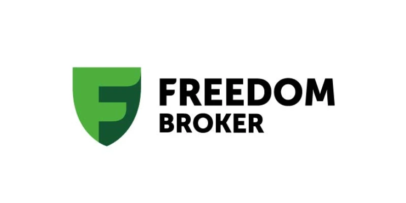
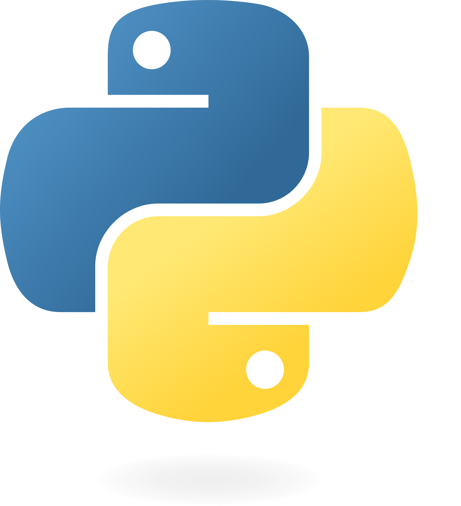
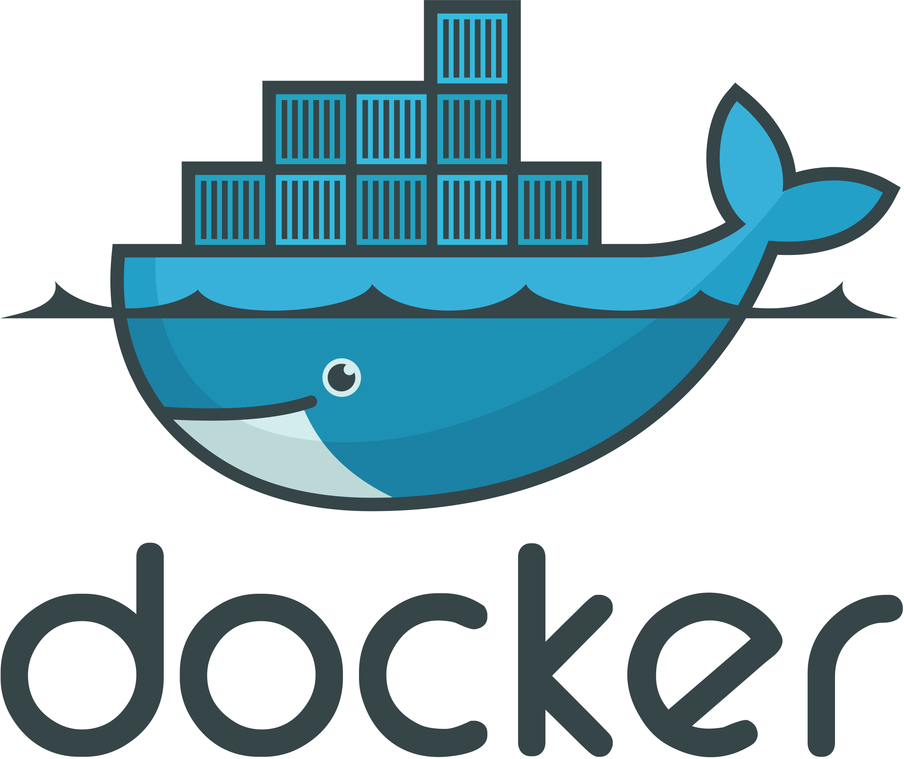

<p align="center">
  
</p>

# Freedom Broker RFM Segmentation 🚀

<p align="center">
  
  
  
  
</p>

> **Hackathon project**: customer segmentation for increasing commission income at Freedom Broker  
> using RFM (Recency, Frequency, Monetary) + KMeans clustering + Airflow automation.

---

🎥 [📽️ Presentation Slides (Google Slides)](https://docs.google.com/presentation/d/1Mc9mmGWhy-LNpTEZVTWo8tHOoso-_cMUcKpmRNRi7T0/edit?usp=sharing)  

---

## 📖 Table of Contents

- [About](#about)  
- [Project Structure](#project-structure)  
- [Setup & Installation](#setup--installation)  
- [Usage](#usage)  
  - [Running Locally with Docker Compose](#running-locally-with-docker-compose)  
  - [Airflow DAGs](#airflow-dags)  
  - [ML Segmentation](#ml-segmentation)  
- [Data Layout](#data-layout)  
- [Contributing](#contributing)  
- [License](#license)  

---

## 🎯 About

Freedom Broker – онлайн-брокер с доступом к акциям, облигациям, валютам и фьючерсам.  
Этот проект автоматизирует RFM-сегментацию клиентов:

1. **Recency**: сколько дней назад была последняя активность  
2. **Frequency**: как часто клиент совершает операции  
3. **Monetary**: сколько клиент приносит комиссий  

Результат — 3 смысловых клиентских сегментов, готовых к персонализированным маркетинговым действиям.

---

## 📂 Project Structure

```

freedom-broker-rfm/
├── README.md
├── dags/
│   ├── dag_freedom-broker-rfm.py
│   ├── dag_freedom-broker-rfm-extended.py
│   ├── first_dag.py
│   └── sql/
│       ├── calculate_rfm_scores.sql
│       ├── create_rfm_table.sql
│       ├── create_segment_demographics.sql
│       ├── create_segment_summary.sql
│       └── create_solution_table.sql
├── data/
│   ├── raw/
│   └── processed/
│       └── cluster_profiles.csv
├── docker-compose.yaml
├── docs/
│   └── images/
│       ├── airflow_logo.png
│       ├── docker_logo.png
│       ├── freedom_broker_logo.png
│       ├── img.png
│       ├── postgres_logo.png
│       ├── python_logo.png
│       └── thank_you.png
├── ml/
│   ├── broker_tiny_prediction.py
│   ├── formulas.md
│   ├── freedom_rfm_unified.ipynb
│   └── model3.ipynb
├── requirements.txt
├── scripts/
├── visualizations/
│   ├── KMeans_heatmap (1).png
│   ├── KMeans_tsne (1).png
│   ├── dashboard.py
│   ├── kmeans_analysis (1).png
│   ├── kmeans_analysis (2).png
│   ├── tg_image_3503182383.png
│   └── tg_image_924826282.png

````

---

## 🛠 Setup & Installation

1. **Clone repository**  
   ```bash
   git clone https://github.com/mutasim77/freedom-broker-rfm.git
   cd freedom-broker-rfm
   ```

2. **Copy environment variables**

   ```bash
   cp .env.example .env
   ```

3. **Install Python dependencies**
   *(если не используете Docker)*

   ```bash
   python3 -m venv venv
   source venv/bin/activate
   pip install -r requirements.txt
   ```

---

## 🚀 Usage

### Running Locally with Docker Compose

```bash
docker-compose up -d
```

* Airflow UI → [http://localhost:8080](http://localhost:8080)
* PostgreSQL доступен на порту 5432
* Adminer UI (опционально) → [http://localhost:8081](http://localhost:8081)

---

### Airflow DAGs

* **`dag_freedom-broker-rfm.py`** — основной pipeline:

  1. Загружает сырые данные
  2. Вычисляет RFM
  3. Сохраняет результаты

* **`dag_freedom-broker-rfm-extended.py`**:

  * Добавляет кластеризацию сегментов

---

## 🤝 Contributing

1. Fork this repo
2. Create a branch: `git checkout -b feature/xyz`
3. Commit your changes
4. Push and open a Pull Request

---

## ⚖️ License

MIT License — not yet but we will🎓

---

<p align="center">
  
</p>
